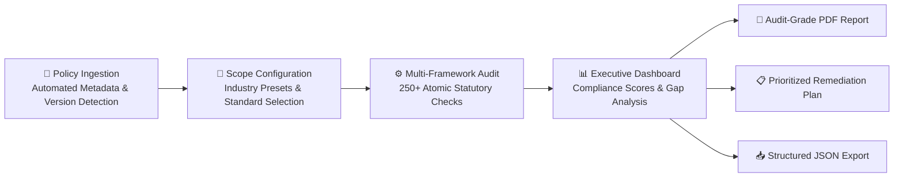

# LexMesh — Multi-Framework Compliance & Legal Audit Engine

**LexMesh** is an enterprise-grade **Multi-Framework Compliance & Legal Audit Engine** designed to automate corporate policy evaluation against major international statutory regulations. 

By mapping and evaluating corporate internal policies against **250+ atomic statutory requirements simultaneously**, LexMesh condenses multi-week legal and audit consulting engagements into a comprehensive, verified audit in **under 45 seconds**.

---

## 🎯 Executive Summary

| Traditional Manual Audits | The LexMesh Automated Approach |
| :--- | :--- |
| ⏳ **3 to 6 weeks** per audit engagement | ⚡ **Under 45 seconds** end-to-end evaluation |
| 💰 **$30,000 – $80,000** in billable legal fees | 📉 **Fraction of the cost** with zero recurring manual labor |
| 📑 Disconnected spreadsheets and static memos | 📊 **Live interactive dashboard** with historical trend analytics |
| ⚠️ Subjective reviewer interpretations | ⚖️ **Deterministic, quote-verified statutory criteria** |
| 🔄 Serial audits (one framework reviewed at a time) | 🌐 **Simultaneous cross-framework synthesis** (GDPR, HIPAA, RBI, SOC 2) |

---

## ⚖️ Regulatory Frameworks Covered

LexMesh systematically audits policy documents against the following core statutory standards:

| Framework | Regulatory Authority | Statutory Scope | Financial & Legal Exposure |
| :--- | :--- | :--- | :--- |
| **EU GDPR** | European Union / DPAs | 99 Articles (Regulation EU 2016/679) | Up to **€20,000,000** or **4% global annual revenue** |
| **US HIPAA** | US Dept. of Health & Human Services | 45 CFR § 160 & § 164 (Security & Privacy) | Up to **$1.9M+ per year** in Civil Monetary Penalties |
| **RBI Cyber** | Reserve Bank of India | Cyber Security & Digital Banking Directives | Banking Regulation Act penalties & enforcement |
| **SOC 2 Type II** | AICPA | Trust Services Criteria (CC1–CC9) | Qualified audit opinion & loss of enterprise contracts |

---

## 🌟 Enterprise Capabilities

### ⚡ Simultaneous Multi-Framework Audit Engine
Evaluates policies across all selected regulatory regimes concurrently, mapping overlapping requirements (such as incident response, encryption standards, access governance, and vendor risk) into a unified cross-regulatory matrix.

### 🔍 Automated Document Intelligence
Intelligently ingests internal corporate policies (PDF) and automatically extracts key metadata—including legal corporate entities, policy categories, effective dates, and version numbering—without requiring manual data entry.

### 🏢 Industry-Specific Scope Presets
Includes pre-configured statutory scoping profiles for specific industry verticals:
- **General SaaS / Technology Enterprise**: Focused on GDPR & SOC 2 Type II.
- **Healthcare & Medical Technology**: Focused on HIPAA & GDPR.
- **Fintech / Banking / NBFC**: Focused on RBI Cyber Security Directives, GDPR & SOC 2.
- **Global Conglomerate**: Full simultaneous coverage across all statutory regimes.
- **Custom Scoping**: Fine-grained toggle control to audit any combination of standards.

### 📊 Statutory Article-Weighted Scoring
Unlike naive keyword matchers, LexMesh groups compliance verdicts by formal statutory chapters and articles. Requirements are assessed with weighted precision (**Fully Met**, **Partially Met**, **Not Met**) to provide mathematically rigorous compliance indexes that accurately reflect regulatory exposure.

### 🚨 Statutory Fine & Legal Exposure Calculator
Calculates real-time financial and legal liability estimates based on statutory penalty tiers, highlighting critical exposure areas before external regulatory audits occur.

### 🎯 Clear Separation: Compliant Areas vs. Remediation Plan
- **Compliant Areas**: Surfaces every verified policy clause alongside the exact document quotes that fulfill regulatory requirements, providing ready-made evidence for external auditors.
- **Prioritized Action Plan**: Consolidates missing provisions into an actionable, prioritized remediation agenda categorized by urgency (**P1 Critical**, **P2 High**, **P3 Medium**).

### 📄 Board-Ready Audit Deliverables
- **Executive Audit PDF Report**: A comprehensive, publication-ready formal audit memorandum detailing scope, methodology, statutory gap breakdown, and compliant quote records.
- **Structured JSON Export**: Machine-readable audit output designed for enterprise SIEM, GRC platforms, and compliance data lakes.

---

## 🔄 How LexMesh Works

1. **Upload Policy Document**: Ingest any corporate privacy, information security, or governance policy.
2. **Select Industry & Framework Scope**: Choose an organizational preset or customize specific standards.
3. **Run Automated Audit**: The engine cross-references the policy text against each statutory mandate simultaneously.
4. **Review & Remediate**: Inspect the interactive executive dashboard, download audit certificates, and review prioritized remediation steps.

---

## 👥 Who Uses LexMesh?

- **Chief Information Security Officers (CISOs)**: To maintain ongoing audit readiness and identify security governance gaps.
- **General Counsel & Corporate Legal Teams**: To ensure compliance across international operations without spending weeks on manual document reviews.
- **Data Protection Officers (DPOs)**: To audit privacy notices, data subject rights handling, and cross-border transfer requirements.
- **Compliance & Risk Managers**: To prepare for upcoming SOC 2, HIPAA, RBI, or GDPR regulatory audits.

---

## 🌐 Live SaaS Access

The LexMesh application is live and available for demonstration:

🔗 **Live Platform Demo**: [https://lexmesh.onrender.com](https://lexmesh.onrender.com)

---

## 📜 Intellectual Property & Attribution

**LexMesh** is engineered and maintained by **Yash Vaswani**.  
All rights reserved. Designed for enterprise legal governance and automated statutory auditing.
