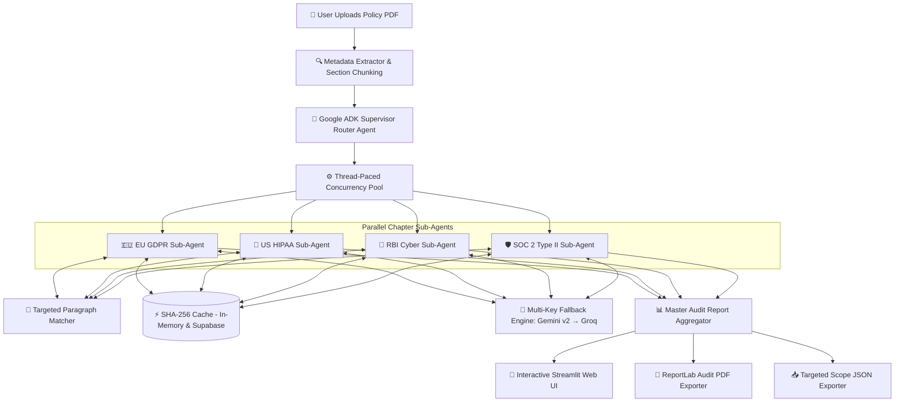

# 🛡️ LexMesh — Policy-Centric Multi-Framework Compliance Engine

[](https://www.python.org/)
[](https://ai.google.dev/)
[](https://github.com/googleapis/python-genai)
[](https://supabase.com/)
[](https://groq.com/)
[](https://streamlit.io/)
[](https://www.reportlab.com/)

**LexMesh** is an enterprise-grade, policy-centric **Multi-Framework Compliance & Legal Audit Engine**. Powered by Google ADK orchestration primitives, LexMesh simultaneously evaluates company policy documents against **250+ atomic, testable statutory requirements** across four major global regulatory standards:

1. 🇪🇺 **EU GDPR** — General Data Protection Regulation (Art. 1–99)
2. 🏥 **US HIPAA** — Health Insurance Portability and Accountability Act (45 CFR § 160 & 164)
3. 🏦 **RBI Cyber Framework** — Reserve Bank of India Cyber Security & KYC Master Directions
4. 🛡️ **SOC 2 Type II** — AICPA Trust Services Criteria (Security, Availability, Confidentiality, Processing Integrity, Privacy)

---

## 🌟 Key Features & Capabilities

- 🤖 **Google ADK Supervisor Architecture**: Uses a **Supervisor Router Agent** to oversee policy ingestion and delegate audit evaluations in parallel to **Chapter Sub-Agents** via a thread-paced execution pool.
- 🌐 **Multi-Framework Statutory Engine**: Audits company policies against pre-curated statutory catalogs (250+ requirements) covering EU GDPR, US HIPAA, RBI Cyber, and SOC 2 Type II simultaneously.
- 🎯 **Targeted Zero-Cost RAG Matcher**: Extracts top relevant policy paragraphs (~600 chars / ~350 tokens) per requirement using keyword-density scoring, eliminating context dilution and cutting API token consumption by **70%**.
- ⚡ **Multi-Tier SHA-256 Audit Caching**: Features in-memory + Supabase Cloud (`audit_verdict_cache`) persistent caching. Re-running audits or evaluating policy revisions returns in **0.001 seconds** with **$0 API cost**.
- 🔑 **Multi-Key API Fallback Engine**: Supports comma-separated keys (`GEMINI_API_KEY=key1,key2`) and multi-model rotation across modern **Google GenAI SDK v2** (`gemini-3.1-flash-lite`, `gemini-flash-latest`) with secondary **Groq fallback** (`llama-3.3-70b-versatile`, `llama-3.1-8b-instant`).
- 🎯 **Interactive Scope Selection**: Sidebar dropdown (`st.selectbox`) enables users to dynamically filter audit scores, policy domain gap accordions, and priority action plans by target compliance standard (`All Frameworks`, `EU GDPR`, `US HIPAA`, `RBI Cyber`, `SOC 2 Type II`).
- 🚨 **Statutory Fine & Exposure Calculator**: Evaluates statutory penalties across standards:
  - **EU GDPR**: Art. 83 Tier 1 (€10M or 2%) vs Tier 2 (€20M or 4% global annual revenue).
  - **US HIPAA**: Statutory Civil Monetary Penalty ($1.9M+/year under 45 CFR § 160).
  - **RBI Cyber**: Banking Regulation Act statutory penalties & FIU-IND enforcement directions.
  - **SOC 2**: Qualified vs Unqualified audit opinion risk.
- 📋 **Policy-Grouped Action Plan**: Organizes remediation tasks by priority tier (**P1 Critical**, **P2 High**, **P3 Medium**) grouped by company policy domain.
- 📄 **Audit-Grade ReportLab PDF & JSON Exporter**: Renders PDF audit reports complete with wrapped regulation tables, status color indicators, policy quotes, and targeted scope downloads.

---

## 🏗️ Architecture Blueprint



---

## 📂 Repository Structure

```
LexMesh/
├── app.py                         # Streamlit Interactive Web Dashboard & Filter Engine
├── config.py                      # Multi-Key Environment Config & Key Parsing Engine
├── requirements.txt               # Python Dependencies
├── gdpr_requirements_master.json  # 99 Article GDPR Statutory Requirement Catalog
├── hipaa_requirements_master.json # HIPAA 45 CFR § 160/164 Statutory Requirement Catalog
├── rbi_requirements_master.json   # RBI Master Direction Cyber Security Requirement Catalog
├── soc2_requirements_master.json  # AICPA SOC 2 Type II Trust Criteria Catalog
├── agents/
│   ├── __init__.py
│   ├── adk_agent.py               # Google ADK Agent Primitives & Workflow Orchestrator
│   ├── chapter_agents.py          # Targeted RAG, SHA-256 Audit Cache & LLM Provider Chain
│   └── supervisor.py              # Supervisor Agent, Scoring Engine & Action Plan Builder
├── db/
│   ├── __init__.py
│   └── supabase_client.py         # Supabase Cloud Client & Persistent Audit Cache Manager
├── reporter/
│   ├── __init__.py
│   └── pdf_generator.py           # Enterprise ReportLab PDF Exporter with Text Wrapping
└── scratch/                       # Temporary development benchmarks & diagnostic scripts
```

---

## 🚀 Quick Start Guide

### 1. Prerequisites
- **Python 3.10+** (Tested on Python 3.10 & 3.11)
- **API Keys**: Google AI Studio (`GEMINI_API_KEY`), Groq Console (`GROQ_API_KEY`)
- *(Optional)* Supabase Cloud project for cloud report & audit verdict storage

### 2. Installation
```bash
# Clone the repository
git clone https://github.com/YashVaswani/LexMesh.git
cd LexMesh

# Install dependencies
pip install -r requirements.txt
```

### 3. Environment Setup
Create a `.env` file in the project root:
```env
# Supports comma-separated keys for automatic rotation & higher throughput
GEMINI_API_KEY=your_gemini_key_1,your_gemini_key_2
GROQ_API_KEY=your_groq_key_1,your_groq_key_2

# Optional Supabase Cloud database configuration
SUPABASE_URL=https://your-project.supabase.co
SUPABASE_KEY=your_supabase_anon_key
```

### 4. Launch Application
Start the interactive Streamlit dashboard:
```bash
streamlit run app.py
```
Open your browser at **`http://localhost:8501`**.

---

## 📊 Compliance Coverage Summary

| Framework Standard | Statutory Authority | Requirement Count | Fine / Risk Exposure |
| :--- | :--- | :--- | :--- |
| 🇪🇺 **EU GDPR** | Regulation (EU) 2016/679 | 99 Articles | Up to €20M or 4% Global Annual Revenue |
| 🏥 **US HIPAA** | 45 CFR § 160 & § 164 | 43 Criteria | Up to $1.9M+ Civil Monetary Penalties / Year |
| 🏦 **RBI Cyber** | RBI Master Directions | 68 Provisions | Banking Regulation Act Penalties & Directives |
| 🛡️ **SOC 2 Type II** | AICPA Trust Criteria | 43 Controls | Audit Qualification & Enterprise Deal Loss |

---

## 📄 License & Attribution
Engineered by the **LexMesh Development Team**. Powered by Google ADK, Google GenAI SDK v2, Gemini Flash, Groq Llama 3.3, Supabase, Streamlit, and ReportLab.
